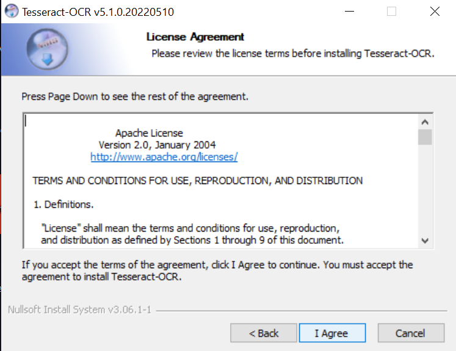
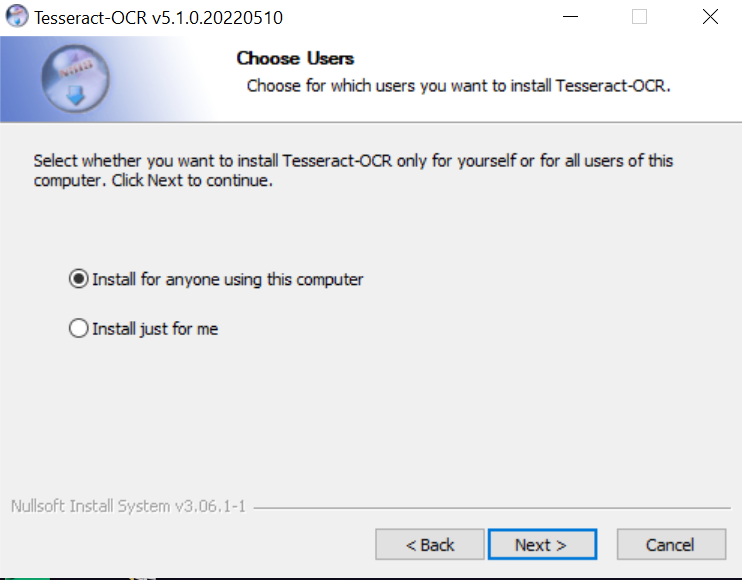
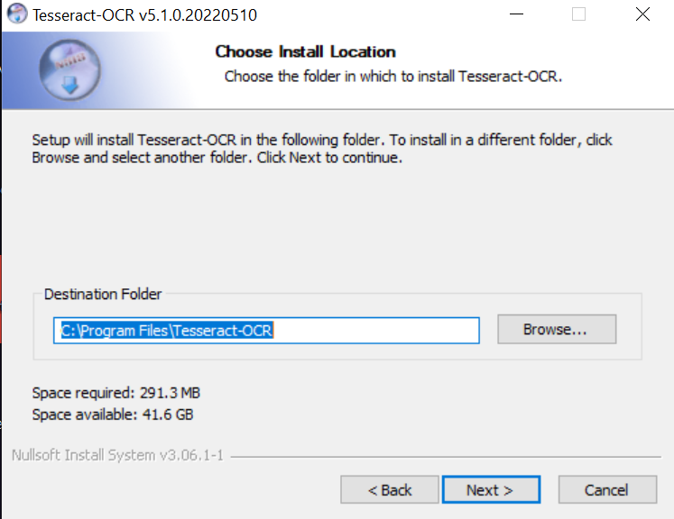
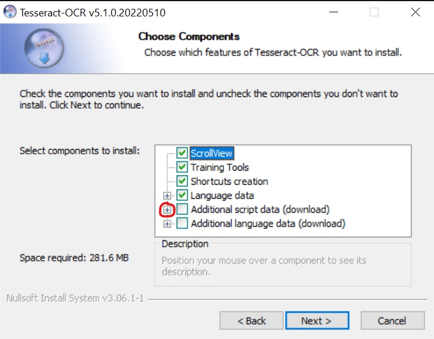
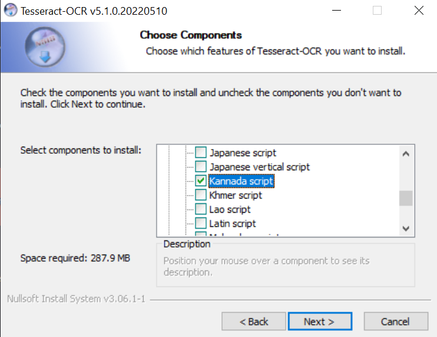
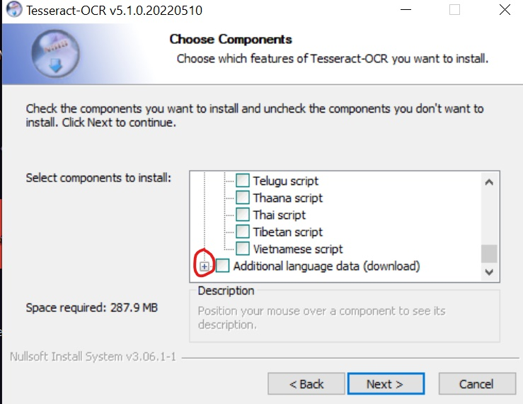
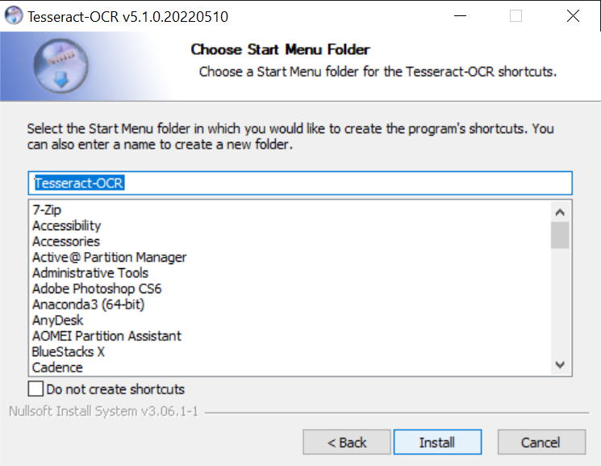

# Installation of Tesseract for Windows

Installing tesseract-ocr in the system
   - **Download tesseract**
     - go to the <a href="https://github.com/UB-Mannheim/tesseract/wiki">website</a>
     - click on `tesseract-ocr-w64-setup-v5.0.0-alpha.20200328.exe (64 bit)`.
   - **Install tesseract for Kannada Language and Script**
     - open the downloaded file and click next and accept the agreement.
        

         &nbsp;
        
        

     - Next you will give an option to choose the languages.
        

         &nbsp;
        
        

     - **Choose kannada in both script and language**
        *Script*
        

         &nbsp;
        
        

        *Language*

        

         &nbsp;
        
        

   - **Add tesseract to Path**
     - Check if this folder `C:\Program Files\Tesseract-OCR\` is present. If yes, follow below procedure
     - Add `C:\Program Files\Tesseract-OCR\`  to your system PATH by doing the following
        1. Click on the `Windows start button`, search for `Edit the system environment variables`, click on Environment Variables
        2. Under System variables, look for and double-click on PATH, click on `New`.
        3. then add `C:\Program Files\Tesseract-OCR\`, click OK.
     - if folder is not present, manually add the folder tesseract-ocr to the Program Files in the C drive which must be present at the download section (after extraction) and follow the same procedure
     - See complete [docs](docs/tesseract_installation/README.md).
